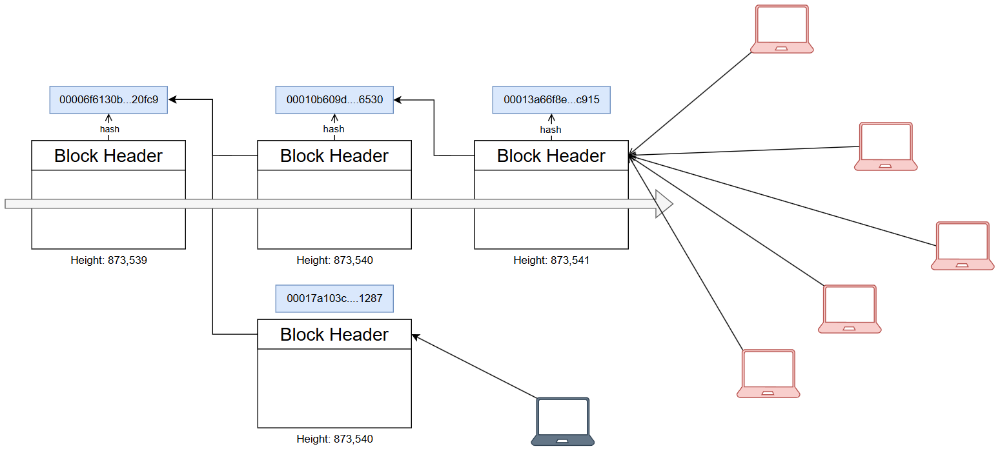
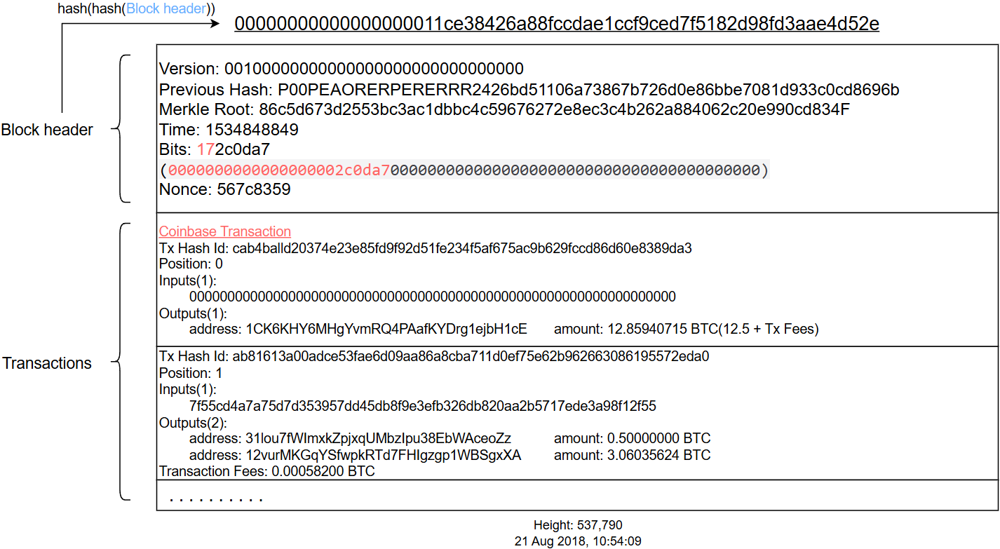
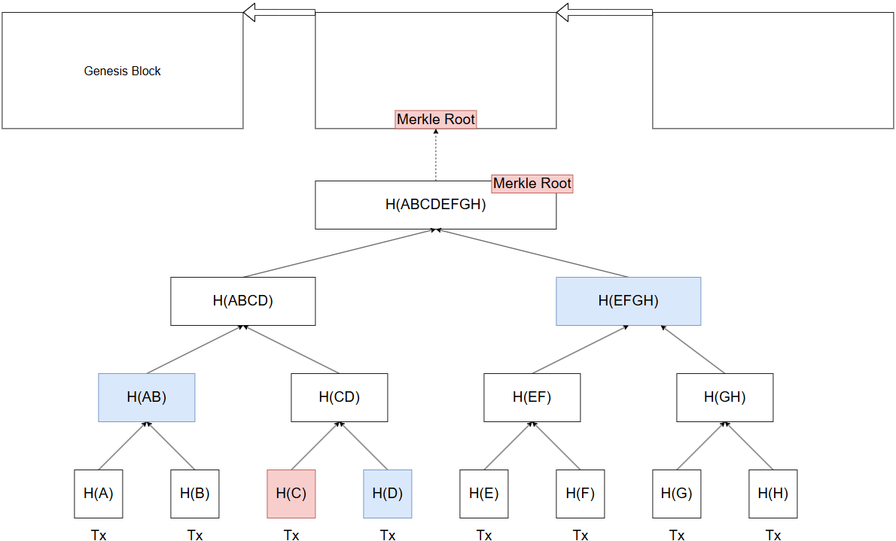
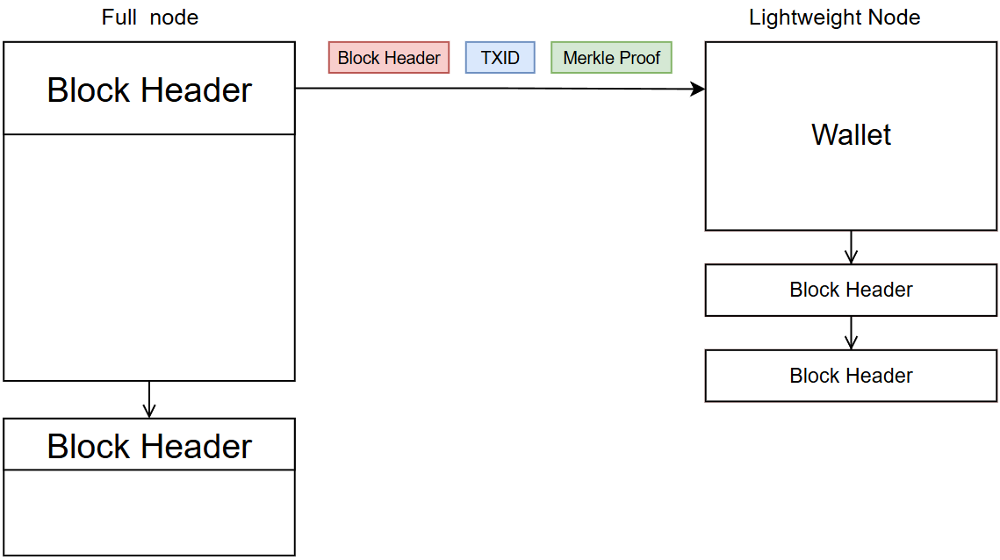

Reference: https://learnmeabitcoin.com/
# Blockchain

Height: The height of a block indicates its position in the blockchain.
## Longest Chain:

The longest chain principle is the key mechanism for Bitcoin network to reach consensus. All nodes assume that the longest chain is the valid main chain and work based on the longest chain. This ensures the consistency of the data of the entire blockchain.

> 最长链原则是比特币网络达成共识的关键机制
> 所有节点都默认最长链是有效的主链，并且以最长链为基础进行工作。这样就保证了整个比特币网络数据的一致性

Double Spending Attack: the attacker try to reuse the same funds on different branches.
By following the longest chain principle, once a transaction is included in a block of the longest chain, transactions in other chains will not be recognized by most nodes, thus preventing double-spending attacks.

> 双花攻击：攻击者尝试在不同的分支上花费同一笔钱
> 通过遵循最长链原则，一旦交易被包含在最长链中，其他分支的交易则不会被承认

When two miners mine new block at almost the same time, two branches are generated, each with a new block connected to the previous blockchain. But over time, one of the branches will become the longest chain because more new blocks are added later. The transactions of the other branch will not be recognized, and the miners will re-broadcast the transactions of this block and re-package it into the block in the longest chain.

> 当两个矿工几乎同时挖出新区块时，就会产生两个分支，每个分支都有一个新区块连接到前一个区块链。但随着时间的推移，其中一个分支将成为最长的链，因为后来有更多新区块被添加。另一个分支的交易将不会被承认，矿工则会重新将此区块的交易广播出去，重新的打包到最长链中的区块上.

## Comfirmation

In order to prevent the generation of a new longest chain, the Bitcoin network usually recommends waiting for multiple blocks to confirm the validity of a transaction.

Each block takes about 10 minutes to generate, so it takes about 60 minutes to wait for 6 blocks to be confirmed.

This process is actually to continuously verify the previous blocks containing transactions through subsequent blocks. As the number of confirmed blocks increases, the position of the transaction in the longest chain becomes more stable, and the possibility of double spending becomes less.

> 为了防范新的最长链产生，比特币网络通常建议等待多个区块确认交易的有效性。一般来说，经过 6 个区块确认后的交易，被双花的概率极低。每个区块的产生时间大约是 10 分钟，所以等待 6 个区块确认大约需要 60 分钟。这一过程实际上是通过后续的区块不断对之前包含交易的区块进行验证，随着确认区块数量的增加，交易在最长链中的位置就越稳固，双花的可能性就越小。

# Block Header


```cpp
class BlockHeader {
	public:
		int32_t Version;
		uint256 PreviousBlockHash;
		uint256 MerkleRootHash;
		uint32_t Timestamp;
		uint32_t TargetToBeSolved;
		uint32_t NonceForProofOfWork;
};
```

## Version

The version field is basically used to "vote" for proposed upgrades to the software.

However, bitcoin is decentralized, so there's no central authority to force everyone to upgrade to new versions of the software. Therefore, it's ideal if the majority of the network can agree to proposed changes in advance.

Genesis Block Version: `Ox00000001`

> 版本号用来标识版本，用于升级或添加新的功能。但是比特币是去中心化的，不会有中央机构强制要求升级，网络中大多数节点同意提议是理想选择。

## PreviousBlockHash

The `previous block hash` field in the block header contains the hash of a previous block that the block builds on top of.

Each block links to a previous block, and this creates a chain of blocks.

Genesis Block's Previous Block Hash: `all zero`

> 前一个区块的hash保存在块头，标识前一个区块的hash
> 每一个区块链接到前一个区块，从而构成区块链

## MerkleRootHash

Merkle Root Hash is a unique hash fingerprint for all the transactions in a block, which is created by hasing together paris of TXIDs.

> Merkle Root Hash 是一个区块的所有交易的唯一的hash指纹， 通过使用对所有交易进行hash256算法，得到的一个唯一散列值
### Why Merkle Tree

If it is only for ensuring that all transactions are immutable, it is completely possible to perform hash256 on the TXID of all transactions to get a hash value.

But what we also need is to be able to quickly and easily verify whetehr a transaction exsits in a certian block.

> 如果仅仅是为了保证所有交易不可篡改，完全可以将所有交易的TXID进行hash256，得到一个散列值。
> 但是我们还需要的是能够快速并方便地验证一个交易是不是存在于某个区块上
### How Merkle Proof works

So by using a merkle tree, we can find out if a transaction is part of a block without having to know every TXID in the block.

> 使用Merkle Tree，我们可以验证一笔交易是否存在某个区块上，并且不需要知道所有的交易。


A lightweight node can verify a transaction without downloading the entire blockchain.
These wallet just download and store block headers and use the merkle roots inside them to verify that a transaction has made it  in to a block.


## Time

The Time field in the block header indicates the rough time a block was created.

Genesis Block Time: 1231006505 (_03 Jan 2009, 18:15:05_)

## Target(Bits)

The target is a number that a block hash for a candidate block must get below before the block can be added on to the blockchain. 

The target adjusts every 2016 blocks (roughly two weeks) to try and ensure that blocks are mined **once every 10 minutes** on average.

### How is the target calculated
On every 2016th block, each node will look at the time between the previous 2015 blocks and work out if they were mined faster of slower than 10mins on average.
if fater, the target will adjust downwards to make it more difficult to get below the target for the next period of blocks. 
Conversely, if blocks were mined _slower_ than every 10 minutes, the target will adjust upwards to make it **less difficult** to get below the target for the next period of blocks.

$$
\text{newDifficulty} = \text{oldDifficulty} \times \left( \frac{2016 \times 10\ \text{minutes}}{\text{actualTimeToGenerateLast2016Blocks}} \right)
$$
$$
\text{Target} = \frac{\text{maximumTargetValue}}{\text{difficulty}} 
$$

`actualTimeToGenerateLast2016Blocks`: 上一个2016个区块的出块总时长
`2016 x 10 mins`: 预期的总时长
`maximumTargetValue`: 是一个固定值`0x00000000FFFFFFFFFFFFFFFFFFFFFFFFFFFFFFFFFFFFFFFFFFFFFFFFFFFFFFFF`
`创世区块`
- `Height`: 0
- `Target`: 08fffff00
- `Difficulty`: 1

因此：区块的难度是随着2016个区块的出块时间，动态调整的。当过去的2016个区块实际生成时间比理论上的20160分钟要快，则`new_difficulty`则会增大，进而`target`变小，反之亦然。以此来维持一个相对平衡的出块时间。

### How do nodes calculate the same target

Each node on the network is independently, so there is no central authority to determine the current target value.

nodes always adopt the longest chain of blocks as their blockchain, they will each calculate the same target.

> 每个节点独立运行，并没有中央机构来确定目标target。节点总是会采用最长的区块链，因此他们各自计算的target总是相同的。

## Nonce

The Nonce is a 4-byte field that can hold numbers between 0 and 4294967295 (0x0 to 0xffffffff)

Minners can change the Nonce to change the calculated block hash value util they find a hash avlue less than the current Target.

$$
Block Hash = Hash256(Hash256(Version || PBH || MRH || Target || Time || Nonce))
$$

Notes:
1. You do not get closer to mining a block with every hash attempt. Because the result of the hash function is completely unpredictable, and each result is independent of the last.
2. Not every block has a magic nonce value. there will be no nonce value that will produce a right hash value below the target. There are other fields in the block header that can be adjusted, such as the time field and the extraNonce in the coinbase Tx.
