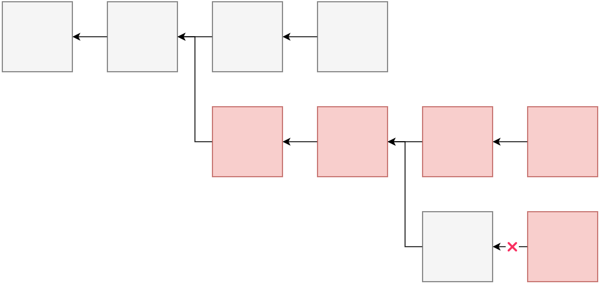
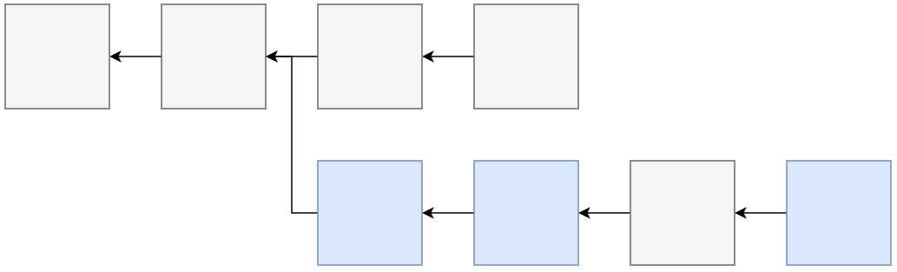

# Fork

- A **hard fork** allows you to directly replace rules and code.
- A **soft fork** involves _adding more code_ to account for new rules.

>硬分叉：替换规则或代码，无法兼容旧版本；
>软分叉：添加新的代码，可以兼容旧版本；
## Hard Fork

## Soft Fork

# Double Spending Attack

# 51% Attack
